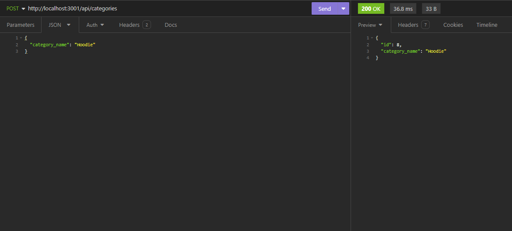

# Commerce One

Welcome to my Commerce One API with Sequelize integration for managing categories, products, and tags. This application allows you to connect to a MySQL database, seed it with test data, and perform CRUD operations through Insomnia Core.

## Getting Started

To get started with this application, please follow the below instructions.

### Prerequisites

Before you begin, ensure you have the following installed:

- Node.js
- MySQL
- Insomnia Core (for testing the API)

### Installation

1. Clone the repository to your local machine.
2. Navigate to the cloned repository folder.
3. Install the required npm packages by running:

```
npm i
```

### Database Setup

1. Create a `.env` file in the root directory of your project.
2. Add the following environment variables with your MySQL credentials:

```
DB_NAME='your_database_name'
DB_USER='your_mysql_username'
DB_PASS='your_mysql_password'
```

### Database Initialization

To set up and seed your database with test data, run the following commands:

1. To create your database schema:

```
npm run db/schema
```

2. To seed the database with test data:

```
   npm run seed
```

### Starting the Server

To start the server and sync Sequelize models to the MySQL database, run:

```
npm start
```

Your server should now be running and listening for requests.

## Using the API

With the server running, you can use Insomnia Core to interact with the API. The API endpoints are structured as follows:

### Categories

- GET `/api/categories` - Fetch all categories.
- POST `/api/categories` - Create a new category.
- PUT `/api/categories/:id` - Update a category by its ID.
- DELETE `/api/categories/:id` - Delete a category by its ID.

### Products

- GET `/api/products` - Fetch all products.
- POST `/api/products` - Create a new product.
- PUT `/api/products/:id` - Update a product by its ID.
- DELETE `/api/products/:id` - Delete a product by its ID.

### Tags

- GET `/api/tags` - Fetch all tags.
- POST `/api/tags` - Create a new tag.
- PUT `/api/tags/:id` - Update a tag by its ID.
- DELETE `/api/tags/:id` - Delete a tag by its ID.

## Models and Relationships

The data models and their relationships are as follows:

- `Category` model:
  - `id` (Primary Key, Integer, Not Null, Auto Increment)
  - `category_name` (String, Not Null)

- `Product` model:
  - `id` (Primary Key, Integer, Not Null, Auto Increment)
  - `product_name` (String, Not Null)
  - `price` (Decimal, Not Null, Must be a decimal value)
  - `stock` (Integer, Not Null, Default value of 10, Must be numeric)
  - `category_id` (Foreign Key, Integer, References `Category` model's `id`)

- `Tag` model:
  - `id` (Primary Key, Integer, Not Null, Auto Increment)
  - `tag_name` (String)

- `ProductTag` model:
  - `id` (Primary Key, Integer, Not Null, Auto Increment)
  - `product_id` (Foreign Key, Integer, References `Product` model's `id`)
  - `tag_id` (Foreign Key, Integer, References `Tag` model's `id`)

### Relationships

- A `Product` belongs to a single `Category`, and a `Category` can have many `Product` models.
- A `Product` can have many `Tag` models, and a `Tag` can belong to many `Product` models through the `ProductTag` join model.

## Testing the API

To test the API, use the following commands in Insomnia Core:

- `GET` to retrieve data.
- `POST` to create new entries.
- `PUT` to update existing entries.
- `DELETE` to remove entries.

Ensure to pass the required parameters and body content for `POST` and `PUT` requests according to the model structure.

### Example


